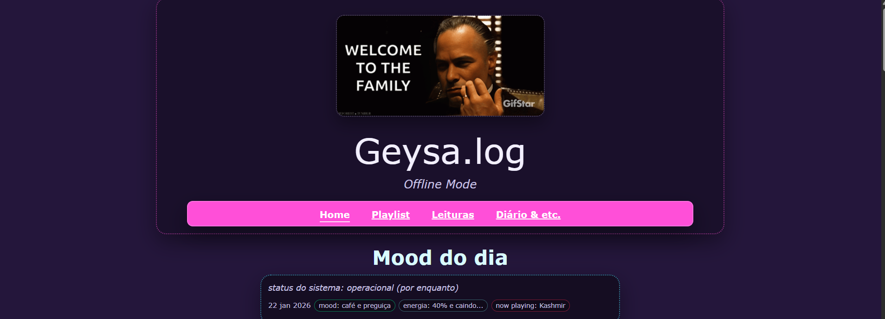

# Geysa.log — Offline Mode



📌 **Site no ar:** https://geysa-stanislav.github.io/Geysa.log/

## Sobre o projeto
Este projeto nasceu como um **desafio da PrograMaria**, depois do curso de **Front-End**, com a missão clássica: criar minha própria página em **HTML + CSS + JavaScript**.

Eu fiz esse blog para **melhorar minhas habilidades**, praticar:
- estrutura semântica e organização de conteúdo
- navegação entre páginas
- responsividade (desktop/mobile)
- UI “anos 2000” + detalhes neon
- JavaScript (componentes simples, como mood do dia e lista de posts)

## Funcionalidades
- Páginas: Home, Playlist, Leituras, Diário & etc.
- “Mood do dia” puxado automaticamente do `etc.html` para a Home
- Sidebar com “Posts anteriores” (lista automática do Diário)

## Checklist (evolução do desafio)
- [x] Estrutura base do site (HTML)
- [x] Estilização e identidade visual (CSS)
- [x] Organização por páginas e navegação
- [x] Publicação no GitHub Pages
- [x] Mood do dia e “Posts anteriores” via JavaScript
- [ ] Melhorar layout mobile (menu e tipografia)
- [ ] Adicionar mais widgets na lateral (tags/arquivos/atalhos)
- [ ] Acessibilidade e ajustes finos de contraste/legibilidade

## Como rodar localmente
Você pode abrir o `index.html` direto, mas o ideal é usar um servidor local (para o `fetch` funcionar corretamente).

### Opção A — VS Code (Live Server)
1. Instale a extensão **Live Server**
2. Clique com o botão direito em `index.html`
3. Selecione **Open with Live Server**

### Opção B — Python (servidor simples)
```bash
python -m http.server 5500


## Autor
Feito por **Geysa** — Offline Mode, online no esforço.

Créditos

Desafio inspirado no pós-curso de Front-End da PrograMaria.
Projeto autoral e em evolução contínua.

